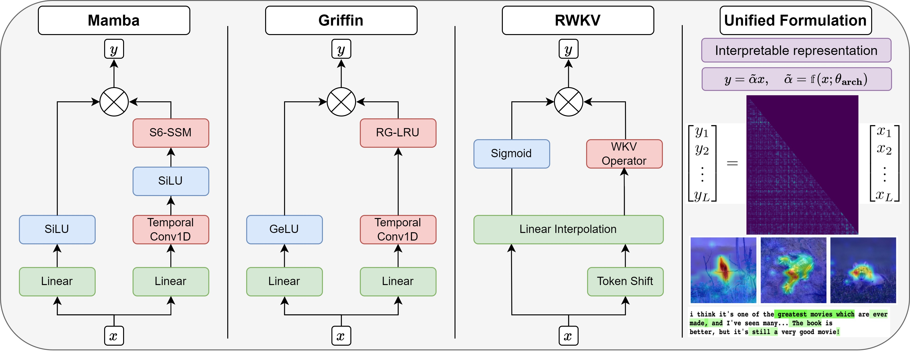
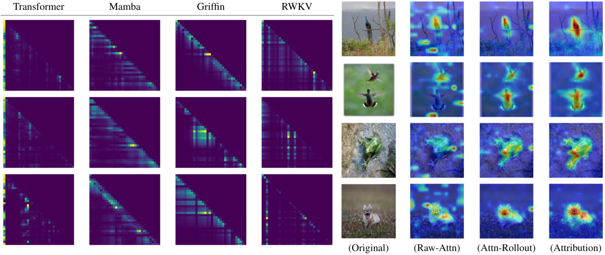

<div align="center">
<h1> A Unified Implicit Attention Formulation for Gated-Linear Recurrent Sequence Models </h1>
Itamar Zimerman<sup>1</sup> *, Ameen Ali<sup>1</sup> * and Lior Wolf<sup>1</sup>
<br>
itamarzimm@gmail.com, ameenali023@gmail.com, liorwolf@gmail.com 
<br>
<sup>1</sup>  Tel Aviv University,  
(*) equal contribution
</div>

<br>
<br>

This repository provides the official implementation for [A Unified Implicit Attention Formulation for Gated-Linear Recurrent Sequence](TODO). 

The purpose of this repository is to provide tools for the explainability and interpretability of modern sub-quadratic architectures, based on implicit attention representation.

<div style="display: flex; justify-content: space-around; align-items: flex-start;">
    <!-- Section for supported models -->
    <div>
        <style>
            ul.no-bullets {
                padding-left: 0; /* Removes the indentation */
            }
        </style>
        <h3> Supported Models:</h3>
        <ul class="no-bullets">
            <li><a href="https://arxiv.org/abs/2312.00752">Mamba</a></li>
            <li><a href="https://arxiv.org/abs/2402.19427">Griffin</a></li>
            <li><a href="https://arxiv.org/abs/2305.13048">RWKV</a></li>
            <li><a href="https://arxiv.org/abs/2401.09417">Vision Mamba</a></li>
        </ul>
    </div>
    <div>
        
        
    </div>
</div>


## Usage:
We provide the following Jupyter notebooks ('I' denotes installation instructions.):
- RWKV
[](todo) (see [I](RWKV&GriffinInstall.md)) 
 - Griffin 
[](todo) (see [I](RWKV&GriffinInstall.md)) 
 - [Mamba](todo) (see [I](MambaNLPInstall.md))
 - [Vision Mamba](todo) (see [I](MambaVisionInstall.md))

## Citation
If you use this codebase, or otherwise found our work valuable, please cite:
```latex
todo
```

## Acknowledgement:
This repository is heavily based on [Transformers](https://github.com/huggingface/transformers) and [Mamba](https://github.com/state-spaces/mamba). Thanks for their wonderful works.